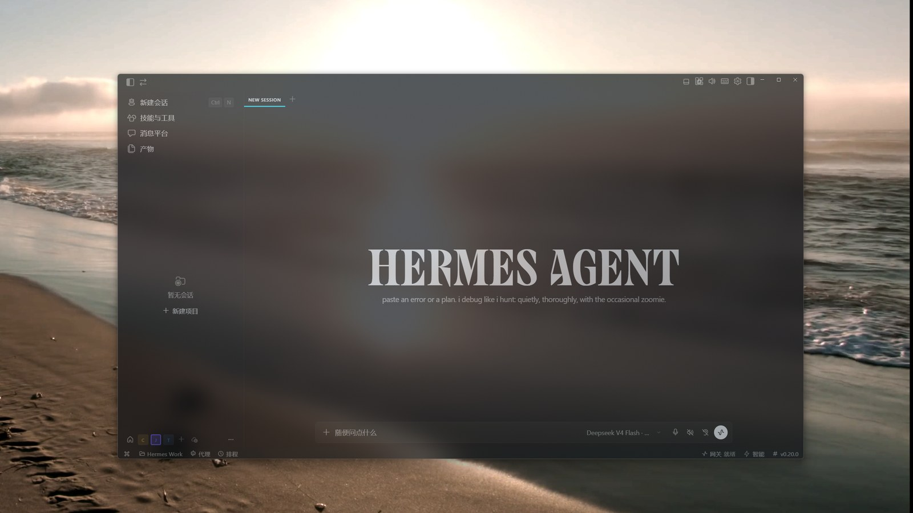

# Frosted Glass Effect for Hermes Desktop

> [中文](README.md)

A native frosted-glass underlay for the **Hermes Desktop** app (Hermes Agent desktop client). It uses the DWM Mica material for real-time blur — no screen capture, no GPU overhead, no touching your app. Just a glass panel sitting right underneath the Hermes window.

Combined with a translucent Hermes window and a transparent-background theme, it delivers a complete frosted-glass desktop: the Hermes UI turns translucent and your wallpaper glows through the blur.

---

## 🚨 Requirements (all mandatory)

| # | Requirement | Notes |
|---|---|---|
| 1 | **Windows 11** (22621+) | Mica requires Win11 |
| 2 | **Windhawk + Translucent Windows mod** | Makes the Hermes window itself translucent — this project only provides the blur backing, not window transparency. [Windhawk](https://windhawk.net) → [Translucent Windows](https://windhawk.net/mods/windhawk-translucent-windows) |
| 3 | **Hermes window translucency at 50%** | Set inside the Windhawk mod; text stays crisp while the desktop glows through |
| 4 | **Hermes in DARK MODE** | The effect depends on a dark theme; in light mode Mica's white haze washes out the UI |

> Missing any of these, and the effect is incomplete or washed out.

---

## Features

- 🪟 **Tight follow**: event-driven (WinEventHook) — drag, resize, minimize, maximize, fullscreen all tracked, <30ms lag
- 🧊 **Native material**: Mica (Win11), blur + anti-aliasing handled by DWM, zero overhead
- 🖱️ **Click-through**: the overlay never intercepts mouse events — pure visual backing
- 🕳️ **No shadow / no taskbar**: `WS_EX_TOOLWINDOW` instance-level style
- 📐 **No fullscreen overflow**: real bounds via `DWMWA_EXTENDED_FRAME_BOUNDS` — no 8px shadow bleed into adjacent monitors
- 🔄 **Self-healing**: re-binds after Hermes restarts, respawns if killed, closes when Hermes exits

## Screenshot



## How it works

```
┌────────────────────────────┐
│  Hermes Desktop (translucent)│  ← target window
├────────────────────────────┤
│  Frost Underlay overlay     │  ← Electron window
│  (DWM Mica material)        │     click-through, frameless, shadowless
└────────────────────────────┘
        ↓ event-driven SetWindowPos
   FrostTracker.exe (WinEventHook)
```

- **main.js** — Electron overlay window (Mica material, click-through, spawns the tracker)
- **FrostTracker.exe** — C# follower: WinEventHook + real-bounds sync of the overlay to Hermes
- **watch.ps1** — daemon: spawns the overlay with Hermes, closes it when Hermes exits, heartbeat file for external watchdogs

## Requirements

- Windows 11 (Mica needs 22621+)
- [Electron](https://www.electronjs.org/) (`npm install electron`)
- .NET Framework 4.x (only to rebuild FrostTracker, ships with Windows)

## Quick start

```powershell
# 1. install electron
npm install electron --save-dev

# 2. one-click start, follows Hermes
powershell -ExecutionPolicy Bypass -File start.ps1
```

Or manually:

```powershell
npx electron .     # or electron.exe main.js
```

Once the overlay appears, drag / resize / fullscreen Hermes and it follows in real time.

## Full glass setup

1. **Windhawk Translucent Windows**: make the Hermes window ~50% translucent (text stays crisp, desktop glows through)
2. **Hermes dark theme + transparent UI background**: semi-transparent dark surfaces suppress Mica's white haze
3. **This project's Mica underlay**
4. **Autostart (optional)**: Startup folder shortcut pointing at `watch.ps1`

## Configuration

| Env var | Description | Default |
|---|---|---|
| `FROST_TARGET` | target process name (Hermes by design) | `Hermes` |
| `FROST_MATERIAL` | material: `mica` / `acrylic` | `mica` |
| `FROST_DARK` | `1` = follow system dark mode (Mica dark variant) | light |
| `ELECTRON_PATH` | full path to electron.exe (used by watch/start scripts) | auto-detect |

## Build FrostTracker

```powershell
cd frost-underlay
"C:\Windows\Microsoft.NET\Framework64\v4.0.30319\csc.exe" /nologo /target:winexe /out:FrostTracker.exe /r:System.Windows.Forms.dll /r:System.Drawing.dll FrostTracker.cs
```

## Autostart (optional)

```powershell
$ws = New-Object -ComObject WScript.Shell
$sc = $ws.CreateShortcut("$env:APPDATA\Microsoft\Windows\Start Menu\Programs\Startup\FrostUnderlayWatch.lnk")
$sc.TargetPath = "C:\Windows\System32\WindowsPowerShell\v1.0\powershell.exe"
$sc.Arguments = "-NoProfile -ExecutionPolicy Bypass -WindowStyle Hidden -File `"$PWD\watch.ps1`""
$sc.WindowStyle = 7
$sc.Save()
```

## FAQ

- **Overflow to other monitors?** Fixed: the follower prefers `DWMWA_EXTENDED_FRAME_BOUNDS` (real bounds), so maximized windows never bleed shadow edges into adjacent monitors.
- **Mica looks hazy?** Mica is a light material; make sure of: Windhawk translucency ~50% + dark theme + semi-transparent dark UI background — that suppresses the haze while keeping the glass feel.
- **Not following after Hermes restarts?** FrostTracker re-binds automatically (30ms fallback poll + events), no action needed.

## License

MIT
