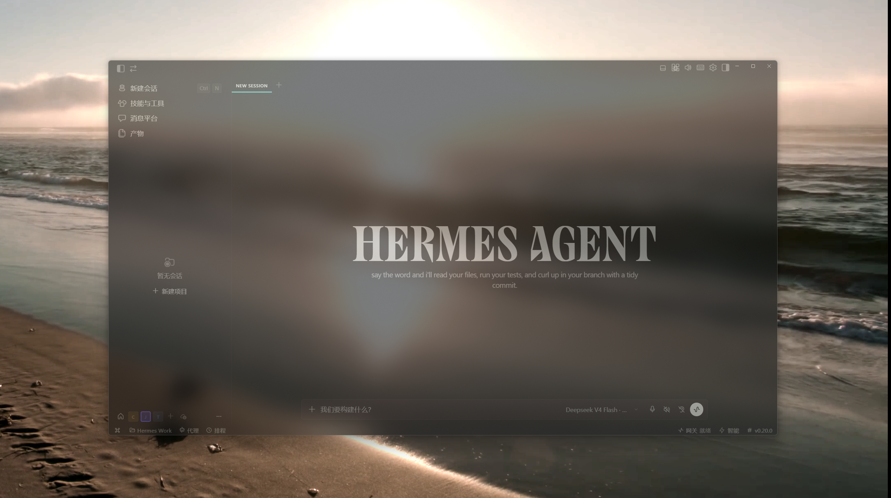

# Hermes Desktop 毛玻璃效果

> [English](README.en.md)

给 **Hermes Desktop**（Hermes Agent 桌面客户端）垫一块 Windows 原生模糊背景板。用 DWM 内置的 Mica 材质做实时模糊——不截屏、不占额外 GPU、不碰窗口内容，只是一个垫在 Hermes 窗口正下方的「玻璃底」。

配合 Hermes 的半透明窗口 + 透明背景主题，就是一套完整的**毛玻璃桌面体验**：Hermes 界面半透明，桌面/壁纸从模糊里透出来。

---

## 🚨 必要条件（缺一不可）

| # | 条件 | 说明 |
|---|---|---|
| 1 | **Windows 11**（22621+） | Mica 材质需要 Win11 |
| 2 | **Windhawk + Translucent Windows 插件** | 让 Hermes 窗口本身半透明（本项目只提供模糊垫底，不负责窗口透明）。[Windhawk](https://windhawk.net) → [Translucent Windows](https://windhawk.net/mods/windhawk-translucent-windows) |
| 3 | **Hermes 窗口透明度设为 50%** | 在 Windhawk 插件里设置，文字仍清晰、桌面能透进来 |
| 4 | **Hermes 使用深色模式** | 玻璃效果依赖深色主题；浅色主题下 Mica 白雾会让界面泛白，效果不可用 |

> 缺任何一条，效果都会不完整或泛白。

---

## 特性

- 🪟 **实时跟随**：事件驱动（WinEventHook），拖动、缩放、最小化、最大化、全屏全部紧贴，最大滞后 <30ms
- 🧊 **原生材质**：Mica（Win11 系统材质），模糊和抗锯齿都由 DWM 完成，零性能开销
- 🖱️ **点击穿透**：遮罩不拦截任何鼠标事件，纯粹视觉垫底
- 🕳️ **无阴影无任务栏**：`WS_EX_TOOLWINDOW` 实例级样式，干净利落
- 📐 **全屏不溢出**：`DWMWA_EXTENDED_FRAME_BOUNDS` 真实边界，最大化不会把 8px 阴影边距溢到相邻屏
- 🔄 **自愈守护**：Hermes 重启自动重新绑定；遮罩被误杀自动复活；Hermes 退出自动关遮罩

## 效果



## 原理

```
┌────────────────────────────┐
│  Hermes Desktop（半透明）    │  ← 目标窗口
├────────────────────────────┤
│  遮罩窗 Frost Underlay      │  ← Electron 窗口
│  （DWM Mica 材质）           │     点击穿透、无边框、无阴影
└────────────────────────────┘
        ↓ 事件驱动 SetWindowPos
   FrostTracker.exe (WinEventHook)
```

- **main.js** — Electron 遮罩窗（Mica 材质、点击穿透、自动拉起跟随器）
- **FrostTracker.exe** — C# 跟随器：监听 Hermes 窗口移动/尺寸事件，实时同步遮罩窗位置尺寸
- **watch.ps1** — 守护脚本：Hermes 在 → 拉遮罩；Hermes 退出 → 关遮罩；心跳文件供外部看门狗

## 环境要求

- Windows 11（Mica 需要 22621+）
- [Electron](https://www.electronjs.org/)（`npm install electron` 即可）
- .NET Framework 4.x（仅编译 FrostTracker 需要，Windows 自带）

## 快速开始

```powershell
# 1. 安装 electron
npm install electron --save-dev

# 2. 一键启动，跟随 Hermes
powershell -ExecutionPolicy Bypass -File start.ps1
```

或手动：

```powershell
npx electron .     # 或 electron.exe main.js
```

遮罩窗出现后，拖动 / 缩放 / 全屏 Hermes 都会实时贴合。

## 完整玻璃效果配置

1. **Windhawk Translucent Windows**：把 Hermes 窗口设为 50% 半透明（文字仍清晰，桌面能透进来）
2. **Hermes 深色主题 + 透明背景**：界面半透明深色，压住 Mica 白雾不泛白
3. **本项目的 Mica 遮罩垫底**
4. **开机自启（可选）**：启动文件夹快捷方式指向 `watch.ps1`

## 配置

| 环境变量 | 说明 | 默认 |
|---|---|---|
| `FROST_TARGET` | 跟随的进程名（默认 Hermes） | `Hermes` |
| `FROST_MATERIAL` | 材质：`mica` / `acrylic` | `mica` |
| `FROST_DARK` | `1` = 跟随系统深色模式（Mica 暗色变体） | 亮色 |
| `ELECTRON_PATH` | electron.exe 完整路径（watch/start 脚本用） | 自动探测 |

## 构建 FrostTracker

```powershell
cd frost-underlay
"C:\Windows\Microsoft.NET\Framework64\v4.0.30319\csc.exe" /nologo /target:winexe /out:FrostTracker.exe /r:System.Windows.Forms.dll /r:System.Drawing.dll FrostTracker.cs
```

## 开机自启（可选）

启动文件夹放一个快捷方式指向 `watch.ps1`：

```powershell
$ws = New-Object -ComObject WScript.Shell
$sc = $ws.CreateShortcut("$env:APPDATA\Microsoft\Windows\Start Menu\Programs\Startup\FrostUnderlayWatch.lnk")
$sc.TargetPath = "C:\Windows\System32\WindowsPowerShell\v1.0\powershell.exe"
$sc.Arguments = "-NoProfile -ExecutionPolicy Bypass -WindowStyle Hidden -File `"$PWD\watch.ps1`""
$sc.WindowStyle = 7
$sc.Save()
```

## 常见问题

- **遮罩溢出到其他屏？** 已修复：跟随器优先取 `DWMWA_EXTENDED_FRAME_BOUNDS`（真实边界），最大化窗口不会带出阴影边距。
- **Mica 泛白？** Mica 本身是浅色半透材质；请确认：Windhawk 透明 50% + 深色主题 + 界面半透明深色背景，即可压住白雾又不失玻璃感。
- **Hermes 重启后不跟随？** FrostTracker 每 30ms 兜底轮询 + 事件驱动，进程重启自动重新绑定主窗口，无需手动干预。

## License

MIT
